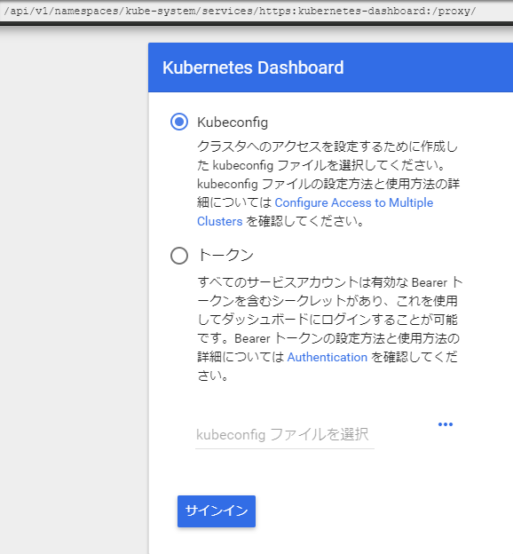
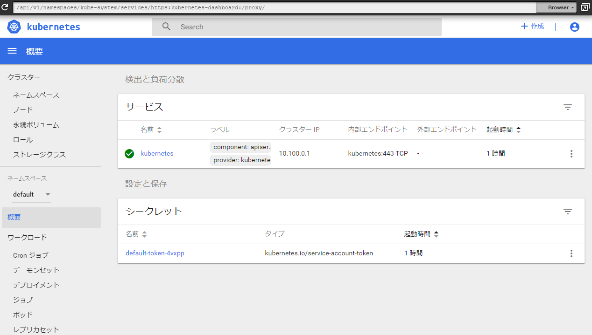

# [Amazon EKS Workshop](https://eksworkshop.com)

#### Advance preparation

- Create AWS Account
- Create IAM User for operation
  - IAM Policy grants "Administrator Access"
- Launch Cloud9
  - Name : eksworkshop-admin
  - Environment Type : EC2(t2.micro)
- Create IAM Role
  - AWS Service : EC2
  - IAM Policy grants "Administrator Access"
  - Attach to EC2 running on Cloud9

#### Install Kubernetes Tools

```
$ aws --version
aws-cli/1.16.169 Python/2.7.16 Linux/4.14.121-85.96.amzn1.x86_64 botocore/1.12.159

$ mkdir -p ~/.kube
$ sudo curl --silent --location -o /usr/local/bin/kubectl https://amazon-eks.s3-us-west-2.amazonaws.com/1.12.7/2019-03-27/bin/linux/amd64/kubectl
$ sudo chmod +x /usr/local/bin/kubectl

$ go get -u -v github.com/kubernetes-sigs/aws-iam-authenticator/cmd/aws-iam-authenticator
$ sudo mv ~/go/bin/aws-iam-authenticator /usr/local/bin/aws-iam-authenticator

$ sudo yum -y install jq gettext
Installed:
  gettext.x86_64 0:0.18.1.1-9.1.11.amzn1                                                                   jq.x86_64 0:1.5-1.2.amzn1                                                                  
Dependency Installed:
  gettext-libs.x86_64 0:0.18.1.1-9.1.11.amzn1                             jq-libs.x86_64 0:1.5-1.2.amzn1                             oniguruma.x86_64 0:5.9.1-3.1.2.amzn1                            

$ for command in kubectl jq envsubst aws-iam-authenticator
   do
     which $command &>/dev/null && echo "$command in path" || echo "$command NOT FOUND"
   done
 kubectl in path
 jq in path
 envsubst in path
 aws-iam-authenticator in path

$ kubectl version
Client Version: version.Info{Major:"1", Minor:"12", GitVersion:"v1.12.7", GitCommit:"6f482974b76db3f1e0f5d24605a9d1d38fad9a2b", GitTreeState:"clean", BuildDate:"2019-03-29T16:15:10Z", GoVersion:"go1.10.8", Compiler:"gc", Platform:"linux/amd64"}
Server Version: version.Info{Major:"1", Minor:"12+", GitVersion:"v1.12.6-eks-d69f1b", GitCommit:"d69f1bf3669bf00b7f4a758e978e0e7a1e3a68f7", GitTreeState:"clean", BuildDate:"2019-02-28T20:26:10Z", GoVersion:"go1.10.8", Compiler:"gc", Platform:"linux/amd64"}
```

#### Clone the service repo

https://github.com/brentley/

```
$ cd ~/environment
$ git clone https://github.com/brentley/ecsdemo-frontend.git
$ git clone https://github.com/brentley/ecsdemo-nodejs.git
$ git clone https://github.com/brentley/ecsdemo-crystal.git
```

#### Update IAM setting your workspace(Cloud9)

1. Return to your workspace and click the sprocket, or launch a new tab to open the Preferences tab
1. Select AWS SETTINGS
1. Turn off AWS managed temporary credentials
1. Close the Preferences tab

```
$ rm -vf ${HOME}/.aws/credentials
$ export ACCOUNT_ID=$(aws sts get-caller-identity --output text --query Account)
$ export AWS_REGION=$(curl -s 169.254.169.254/latest/dynamic/instance-identity/document | jq -r '.region')
$ echo "export ACCOUNT_ID=${ACCOUNT_ID}" >> ~/.bash_profile
$ echo "export AWS_REGION=${AWS_REGION}" >> ~/.bash_profile
$ aws configure set default.region ${AWS_REGION}
$ aws configure get default.region
us-east-1
$ aws sts get-caller-identity
```

#### Create an SSHKey

This key will be used on the worker node instances to allow ssh access if necessary.

```
$ ssh-keygen
$ aws ec2 import-key-pair --key-name "eksworkshop" --public-key-material file://~/.ssh/id_rsa.pub
```

#### setting eksctl

[eks.io](https://eksctl.io/)

```
$ curl --silent --location "https://github.com/weaveworks/eksctl/releases/download/latest_release/eksctl_$(uname -s)_amd64.tar.gz" | tar xz -C /tmp
$ sudo mv -v /tmp/eksctl /usr/local/bin
$ eksctl version
[ℹ]  version.Info{BuiltAt:"", GitCommit:"", GitTag:"0.1.34"}
```

#### Launch EKS

※ Launching EKS and all the dependencies will take approximately 15 minutes

```
$ eksctl create cluster --name=eksworkshop-eksctl --nodes=3 --node-ami=auto --region=${AWS_REGION}
[ℹ]  using region us-east-1
[ℹ]  setting availability zones to [us-east-1a us-east-1d]
[ℹ]  subnets for us-east-1a - public:192.168.0.0/19 private:192.168.64.0/19
[ℹ]  subnets for us-east-1d - public:192.168.32.0/19 private:192.168.96.0/19
[ℹ]  nodegroup "ng-xxxxxxxx" will use "ami-0abcb9f9190e867ab" [AmazonLinux2/1.12]
[ℹ]  creating EKS cluster "eksworkshop-eksctl" in "us-east-1" region
[ℹ]  will create 2 separate CloudFormation stacks for cluster itself and the initial nodegroup
[ℹ]  if you encounter any issues, check CloudFormation console or try 'eksctl utils describe-stacks --region=us-east-1 --name=eksworkshop-eksctl'
[ℹ]  2 sequential tasks: { create cluster control plane "eksworkshop-eksctl", create nodegroup "ng-xxxxxxxx" }
[ℹ]  building cluster stack "eksctl-eksworkshop-eksctl-cluster"
[ℹ]  deploying stack "eksctl-eksworkshop-eksctl-cluster"
[ℹ]  building nodegroup stack "eksctl-eksworkshop-eksctl-nodegroup-ng-xxxxxxxx"
[ℹ]  --nodes-min=3 was set automatically for nodegroup ng-xxxxxxxx
[ℹ]  --nodes-max=3 was set automatically for nodegroup ng-xxxxxxxx
[ℹ]  deploying stack "eksctl-eksworkshop-eksctl-nodegroup-ng-xxxxxxxx"
[✔]  all EKS cluster resource for "eksworkshop-eksctl" had been created
[✔]  saved kubeconfig as "/home/ec2-user/.kube/config"
[ℹ]  adding role "arn:aws:iam::<AWS_ACCOUNT_ID>:role/eksctl-eksworkshop-eksctl-NodeInstanceRole-69YKEY9NM3RS" to auth ConfigMap
[ℹ]  nodegroup "ng-xxxxxxxx" has 0 node(s)
[ℹ]  waiting for at least 3 node(s) to become ready in "ng-xxxxxxxx"
[ℹ]  nodegroup "ng-xxxxxxxx" has 3 node(s)
[ℹ]  node "ip-192-168-20-83.ec2.internal" is ready
[ℹ]  node "ip-192-168-47-162.ec2.internal" is ready
[ℹ]  node "ip-192-168-7-131.ec2.internal" is ready
[ℹ]  kubectl command should work with "/home/ec2-user/.kube/config", try 'kubectl get nodes'
[✔]  EKS cluster "eksworkshop-eksctl" in "us-east-1" region is ready
```

```
$ cat ~/.kube/config
apiVersion: v1
clusters:
- cluster:
    certificate-authority-data: xxxxxxxxxx
    server: https://xxxxxxxxxxx.sk1.us-east-1.eks.amazonaws.com
  name: eksworkshop-eksctl.us-east-1.eksctl.io
contexts:
- context:
    cluster: eksworkshop-eksctl.us-east-1.eksctl.io
    user: i-xxxxxxxxxx@eksworkshop-eksctl.us-east-1.eksctl.io
  name: i-xxxxxxxxxx@eksworkshop-eksctl.us-east-1.eksctl.io
current-context: i-xxxxxxxxxx@eksworkshop-eksctl.us-east-1.eksctl.io
kind: Config
preferences: {}
users:
- name: i-xxxxxxxxxx@eksworkshop-eksctl.us-east-1.eksctl.io
  user:
    exec:
      apiVersion: client.authentication.k8s.io/v1alpha1
      args:
      - token
      - -i
      - eksworkshop-eksctl
      command: aws-iam-authenticator
      env: null
```

- Confirm your Nodes

```
$ kubectl get nodes
NAME                             STATUS   ROLES    AGE   VERSION
ip-192-168-20-83.ec2.internal    Ready    <none>   17m   v1.12.7
ip-192-168-47-162.ec2.internal   Ready    <none>   17m   v1.12.7
ip-192-168-7-131.ec2.internal    Ready    <none>   17m   v1.12.7
```

- Export the Worker Role Name for use throughout the workshop

```
$ INSTANCE_PROFILE_NAME=$(aws iam list-instance-profiles | jq -r '.InstanceProfiles[].InstanceProfileName' | grep nodegroup)
$ INSTANCE_PROFILE_ARN=$(aws iam get-instance-profile --instance-profile-name $INSTANCE_PROFILE_NAME | jq -r '.InstanceProfile.Arn')
$ ROLE_NAME=$(aws iam get-instance-profile --instance-profile-name $INSTANCE_PROFILE_NAME | jq -r '.InstanceProfile.Roles[] | .RoleName')
$ echo "export ROLE_NAME=${ROLE_NAME}" >> ~/.bash_profile
$ echo "export INSTANCE_PROFILE_ARN=${INSTANCE_PROFILE_ARN}" >> ~/.bash_profile
```

#### Deploy the kubernetes

- Deploy the official kubernetes [dashboard](https://kubernetes.io/docs/tasks/access-application-cluster/web-ui-dashboard/)

```
$ kubectl apply -f https://raw.githubusercontent.com/kubernetes/dashboard/master/aio/deploy/recommended/kubernetes-dashboard.yaml
secret/kubernetes-dashboard-certs created
secret/kubernetes-dashboard-csrf created
serviceaccount/kubernetes-dashboard created
role.rbac.authorization.k8s.io/kubernetes-dashboard-minimal created
rolebinding.rbac.authorization.k8s.io/kubernetes-dashboard-minimal created
deployment.apps/kubernetes-dashboard created
service/kubernetes-dashboard created
```

- Since this is deployed to our private cluster, we need to access it via a proxy
- Kube-proxy is available to proxy our requests to the dashboard service
- This will start the proxy, listen on port 8080, listen on all interfaces, and will disable the filtering of non-localhost requests.

```
$ kubectl proxy --port=8080 --address='0.0.0.0' --disable-filter=true &
```

#### Access dashboard

1. In your Cloud9 environment, click "Tools/Preview/Preview Running Application"
2. Scroll to the end of the URL and append
```
/api/v1/namespaces/kube-system/services/https:kubernetes-dashboard:/proxy/
```



3. Copy the output of this command and then click the radio button next to Token then in the text field below paste the output from the last command
```
aws-iam-authenticator token -i eksworkshop-eksctl --token-only
```


