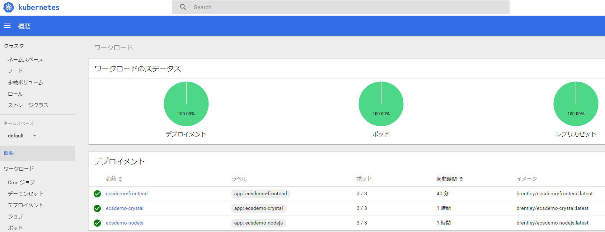

# [Amazon EKS Workshop](https://eksworkshop.com)

[Previous](./01.Dashboard/workshop_1.md) continuation

#### Deploy node.js backend API

- Starting [Deployment](./ecsdemo-nodejs/deployment.yaml)

```
$ cd ~/environment/ecsdemo-nodejs

$ kubectl apply -f kubernetes/deployment.yaml
deployment.apps/ecsdemo-nodejs created

$ kubectl get deployment ecsdemo-nodejs
NAME             DESIRED   CURRENT   UP-TO-DATE   AVAILABLE   AGE
ecsdemo-nodejs   1         1         1            1           40s
```

- Setting [Service](./ecsdemo-nodejs/service.yaml)

```
$ kubectl apply -f kubernetes/service.yaml
service/ecsdemo-nodejs created

$ kubectl get service ecsdemo-nodejs
NAME             TYPE        CLUSTER-IP      EXTERNAL-IP   PORT(S)   AGE
ecsdemo-nodejs   ClusterIP   10.100.15.149   <none>        80/TCP    5m52s
```

#### Deploy crystal backend API

- Starting [Deployment](./ecsdemo-crystal/deployment.yaml)

```
$ cd ~/environment/ecsdemo-crystal
$ kubectl apply -f kubernetes/deployment.yaml
deployment.apps/ecsdemo-crystal created

$ kubectl get deployment ecsdemo-crystal
NAME              DESIRED   CURRENT   UP-TO-DATE   AVAILABLE   AGE
ecsdemo-crystal   1         1         1            1           43s
```

- Setting [Service](./ecsdemo-crystal/service.yaml)

```
$ kubectl apply -f kubernetes/service.yaml
service/ecsdemo-crystal created

$ kubectl get service ecsdemo-crystal
NAME              TYPE        CLUSTER-IP      EXTERNAL-IP   PORT(S)   AGE
ecsdemo-crystal   ClusterIP   10.100.146.66   <none>        80/TCP    53s
```

#### Ensure the ELB service role exists

In AWS accounts that have never created a load balancer before, it’s possible that the service role for ELB might not exist yet.

```
$ aws iam get-role --role-name "AWSServiceRoleForElasticLoadBalancing" || aws iam create-service-linked-role --aws-service-name "elasticloadbalancing.amazonaws.com"
{
    "Role": {
        "Description": "Allows ELB to call AWS services on your behalf.",
        "AssumeRolePolicyDocument": {
            "Version": "2012-10-17",
            "Statement": [
                {
                    "Action": "sts:AssumeRole",
                    "Effect": "Allow",
                    "Principal": {
                        "Service": "elasticloadbalancing.amazonaws.com"
                    }
                }
            ]
        },
        "MaxSessionDuration": 3600,
        "RoleId": "AROAIUJJQ4HWNYWFP6CYM",
        "CreateDate": "2018-01-20T02:15:26Z",
        "RoleName": "AWSServiceRoleForElasticLoadBalancing",
        "Path": "/aws-service-role/elasticloadbalancing.amazonaws.com/",
        "Arn": "arn:aws:iam::<AWS_ACCOUNT_ID>:role/aws-service-role/elasticloadbalancing.amazonaws.com/AWSServiceRoleForElasticLoadBalancing"
    }
}
```

#### Deploy frontend service

- Starting [Deployment](./ecsdemo-frontend/deployment.yaml)

```
$ kubectl apply -f kubernetes/deployment.yaml
deployment.apps/ecsdemo-frontend created

$ kubectl get deployment ecsdemo-frontend
NAME               DESIRED   CURRENT   UP-TO-DATE   AVAILABLE   AGE
ecsdemo-frontend   1         1         1            1           20s
```

- Setting [Service](./ecsdemo-frontend/service.yaml)

```
$ kubectl apply -f kubernetes/service.yaml
service/ecsdemo-frontend created

$ kubectl get service ecsdemo-frontend
NAME               TYPE           CLUSTER-IP       EXTERNAL-IP                                                               PORT(S)        AGE
ecsdemo-frontend   LoadBalancer   10.100.112.169   xxxxxxxxxxxxxxxx.us-east-1.elb.amazonaws.com   80:30761/TCP   17s
```

#### Find the service address


```
$ kubectl get service ecsdemo-frontend -o wide
NAME               TYPE           CLUSTER-IP       EXTERNAL-IP                                                               PORT(S)        AGE   SELECTOR
ecsdemo-frontend   LoadBalancer   10.100.112.169   xxxxxxxxxxxxxxxx.us-east-1.elb.amazonaws.com   80:30761/TCP   10m   app=ecsdemo-frontend
```
You should also be able to copy/paste the loadBalancer hostname into your browser and see the application running.


#### Scale the backend services

```
$ kubectl get deployments
NAME               DESIRED   CURRENT   UP-TO-DATE   AVAILABLE   AGE
ecsdemo-crystal    1         1         1            1           58m
ecsdemo-frontend   1         1         1            1           35m
ecsdemo-nodejs     1         1         1            1           71m

$ kubectl scale deployment ecsdemo-nodejs --replicas=3
deployment.extensions/ecsdemo-nodejs scaled

$ kubectl scale deployment ecsdemo-crystal --replicas=3
deployment.extensions/ecsdemo-crystal scaled

$ kubectl get deployments
NAME               DESIRED   CURRENT   UP-TO-DATE   AVAILABLE   AGE
ecsdemo-crystal    3         3         3            3           61m
ecsdemo-frontend   1         1         1            1           37m
ecsdemo-nodejs     3         3         3            3           74m
```

#### Scale the frontend

```
$ kubectl get deployments
NAME               DESIRED   CURRENT   UP-TO-DATE   AVAILABLE   AGE
ecsdemo-crystal    3         3         3            3           62m
ecsdemo-frontend   1         1         1            1           39m
ecsdemo-nodejs     3         3         3            3           75m

$ kubectl scale deployment ecsdemo-frontend --replicas=3
deployment.extensions/ecsdemo-frontend scaled

$ kubectl get deployments
NAME               DESIRED   CURRENT   UP-TO-DATE   AVAILABLE   AGE
ecsdemo-crystal    3         3         3            3           63m
ecsdemo-frontend   3         3         3            3           39m
ecsdemo-nodejs     3         3         3            3           75m
```




#### Cleanup the applications

```
$ cd ~/environment/ecsdemo-frontend
$ kubectl delete -f kubernetes/service.yaml
service "ecsdemo-frontend" deleted
$ kubectl delete -f kubernetes/deployment.yaml
deployment.apps "ecsdemo-frontend" deleted

$ cd ~/environment/ecsdemo-crystal
$ kubectl delete -f kubernetes/service.yaml
service "ecsdemo-crystal" deleted
$ kubectl delete -f kubernetes/deployment.yaml
deployment.apps "ecsdemo-crystal" deleted

$ cd ~/environment/ecsdemo-nodejs
$ kubectl delete -f kubernetes/service.yaml
service "ecsdemo-nodejs" deleted
$ kubectl delete -f kubernetes/deployment.yaml
deployment.apps "ecsdemo-nodejs" deleted

$ kubectl get deployment
No resources found.
```
